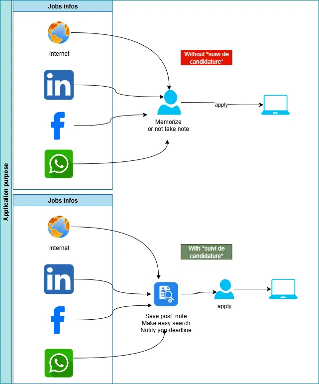

Suivi Candidature est une application  open source développée par Abdoulaye OUATTARA, Data Engineer/DevOPs.
contact: [contact@abouattara.perso.bf](mailto:contact@abouattara.perso.bf)

setup : [Disponible ici](https://drive.google.com/drive/folders/1hJtliq0oTOd5LCdyZLP1wvvg47HZQ8wo?usp=sharing)

Les fonctionnalité de l'application

⦁	Elle vous permet d'avoir un oeil sur vos candidatures prévues pour postulé, déjà postulé, et votre note sur le poste.

⦁	Vous pourrez facilement vous repérez quelque soit le moment de la candidature.

Objectif: faciliter la gestion de mes candidatures

Cette présente application n'est pas commerciale, elle libre et le code source est disponible ici : https://github.com/abouattara
